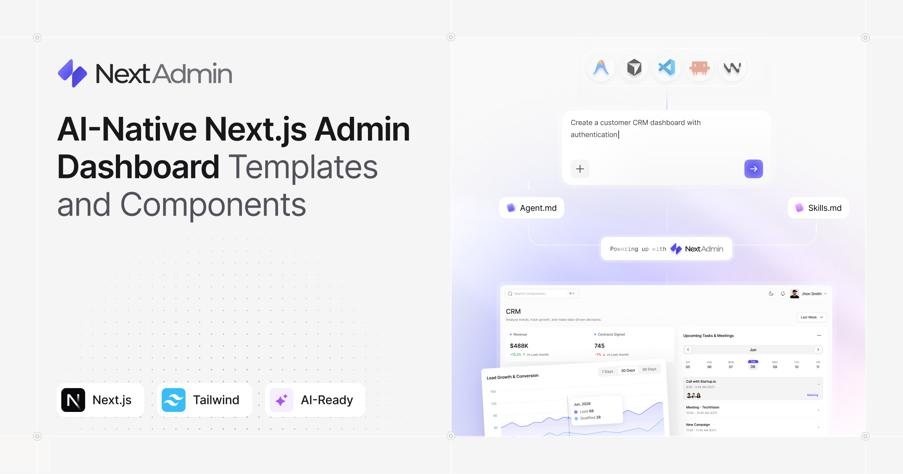

# NextAdmin - AI-First Next.js Admin Dashboard Template
**NextAdmin** is a free, open-source Next.js admin dashboard with essential UI components, blocks, pages, and multiple dashboards. Version 2.0 also ships AI rules and context files, so Claude Code, Cursor, Codex, and any other agent can read your project and build features that match your patterns instead of inventing their own.

[](https://nextadmin.co/)

---

## What's new in v2.0

- Redesigned the entire dashboard with a modern look and better visual hierarchy
- Replaced raw UI components with Tailgrids UI for consistent design and accessibility
- Made all pages interactive and connected them to mock REST APIs
- Restructured the codebase around deep modularity and added AI guidelines in `AGENTS.md`
- Released AI `Agent Skills` for an AI native workflow
- Released Custom Prompts to speed up development

... and more, full list: [nextadmin.co/update-logs](https://nextadmin.co/update-logs)

## Useful Links

- [Website](https://nextadmin.co/)
- [Live Demo](https://demo.nextadmin.co/)
- [Docs](https://nextadmin.co/docs)
- [Components](https://nextadmin.co/components)
- [AI](https://nextadmin.co/ai)
- [Update Logs](https://nextadmin.co/update-logs)

## What's inside

- **Next.js 16 and Tailwind CSS** as the base, so the stack stays familiar
- **200+ UI components** covering tables, forms, charts, cards, modals, and dashboard elements
- **Pre-built pages** for login, signup, profile, settings, calendar, and more
- **Multiple dashboards** for analytics, e-commerce, CRM, and marketing
- **Dark and light mode** built in, with colors checked on both
- **Figma design source** if you want to move things around before touching code
- **Mock REST APIs** behind every page, shaped the way a real API would be

Integrations already wired up: TailGrids UI, Recharts, Leaflet, TanStack Table, Zod, and FullCalendar.

## Quick start

You'll need Node.js installed. Then:

```bash
git clone https://github.com/NextAdminHQ/nextjs-admin-dashboard.git
cd nextjs-admin-dashboard
```

Install dependencies:

```bash
npm install
```

Then start the dev server:

```bash
npm run dev
```

Open [http://localhost:3000](http://localhost:3000) and you're good. **Happy coding**!

## Working with AI agents

Open the project in Claude Code, Cursor, Codex, Copilot, or Zed. Your agent reads `AGENTS.md` and the skill files, then builds inside the structure that's already there, so folders, naming, and styling stay the same across sessions.

You can point an agent at an empty repo and ask for an admin dashboard, and it will get you something. The problem shows up on the second and third session, when it picks a different folder layout, a different auth approach, and styles components a little differently each time. You end up fixing patterns instead of shipping features.

NextAdmin gives it a starting point that doesn't move. The components, the auth screens, the data shape, and the rules are already decided, so each session picks up where the last one left off.

A few things worth knowing:

- **Agent Skills** give your agent the full picture of the components, design system, and file structure, so it doesn't start from zero
- **React Aria skills** keep keyboard navigation, focus, and ARIA attributes correct after your agent edits a component
- **The api-integration skill** swaps the mock data for your live endpoints from a single prompt
- **Custom Prompts** cover the common jobs across core setup, layout, UI, and auth, ready to copy into your editor

## Deploying

Works out of the box with any provider supporting Next.js, including Vercel, Netlify, and Cloudflare.

## Docs

Full docs of the project are available at [nextadmin.co/docs](https://nextadmin.co/docs). There are machine-readable context files alongside them, so your AI tools can read the docs too.

## Pro

The free version covers most of what you need to get a dashboard running. If you want the full set of components, extra dashboards, and the Figma file, there's a Pro version at [nextadmin.co/pricing](https://nextadmin.co/pricing).

## Community

- [Discord](https://pimjo.com/community)
- [X / Twitter](https://twitter.com/PimjoHQ)
- [GitHub](https://github.com/NextAdminHQ/)

Issues and pull requests are welcome. If something is broken or missing, open an issue and we'll take a look.

## Update Logs

### Version 2.0.0 - [July 20, 2026]

- **Complete UI/UX Overhaul**: Redesigned the entire dashboard with a modern aesthetic and enhanced visual hierarchy.
- **Design System Integration**: Replaced raw UI components with Tailgrids UI for improved design consistency and accessibility.
- **Expanded Page & Component Library**: Added 10+ new pages and 20+ customizable component variants.
- **Functional Mock API Integration**: Made all pages interactive and connected them with mock REST APIs.
- **AI-Native Repository**: Optimized codebase architecture following deep modularity principles and added comprehensive AI guidelines in `AGENTS.md`.
- **Custom Agent Skills & Accessibility**: Integrated `/api-integration` for instant API binding and `/react-aria` to enforce WCAG best practices and accessible UI primitives.

### Version 1.3.0 - [May 14, 2026]

- Updated Next.js, Tailwind CSS, and all dependencies to their latest versions.
- Replaced `next-auth` with `better-auth`.
- Made authentication and authorization dynamic.
- Added 2 Step verification, email verification, and password reset.
- Added `Admin` plugin from `better-auth` for RBAC.
- Replaced Algolia search with `cmdk`.
- Improved ApexCharts hydration handling.
- Moved utility files from `libs` into `utils`.
- Fixed file and folder naming inconsistencies.
- Reorganized environment variables and removed unused entries.
- Renamed the unused proxy file to `example.proxy.ts` and fixed its import path.
- Fixed modal position shift issues.
- Improved responsiveness across marketing, CRM, profile, manage team, tables, and not found pages.

### Version 1.2.3 - [Mar 16, 2026]

- Update Next.js to ^16.1.6 and configure image qualities

### Version 1.2.2 - [Dec 01, 2025]

- Updated to Next.js 16
- Updated all the dependencies.

### Version 1.2.1 - Fix peer dependency issue - [Mar 19, 2025]

- Fixed peer dependency issue with React 19
- Migrated from `react-table` to `@tanstack/react-table`
- Fixed reference error in `top-countries/map.tsx` component

### Version 1.2.0 - Major Upgrade and UI Improvements - [Jan 27, 2025]

- Upgraded to Next.js v15 and updated dependencies
- API integration with loading skeleton for tables and charts.
- Improved code structure for better readability.
- Rebuilt components like dropdown, modals, and all ui-elements using accessibility practices.
- Using search-params to store dropdown selection and refetch data.
- Semantic markups, better separation of concerns and more.

### Version 1.1.0 - Initial Release - [May 13, 2024]

- Updated Dependencies
- Removed Unused Integrations
- Optimized App

### Version 1.0.0 - Initial Release - [May 13, 2024]

- Initial release
